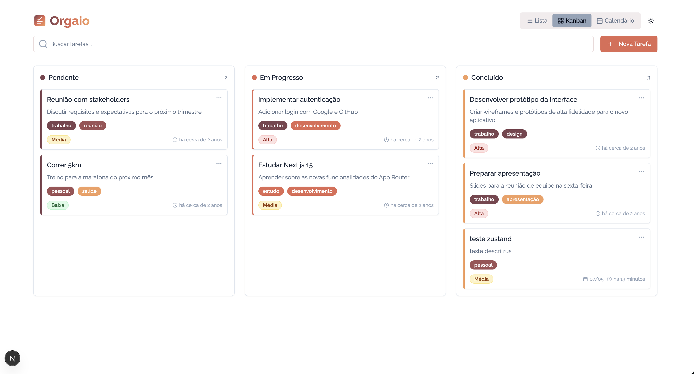

# 🎯 Orgaio

Orgaio is a modern task management application built with Next.js, TypeScript, and Tailwind CSS. It offers an intuitive and responsive interface to efficiently organize your tasks.



## ✨ Features

- 📱 **Responsive Interface**: Design adaptable for desktop and mobile devices
- 🎨 **Light/Dark Theme**: Support for light and dark themes with persistence
- 📊 **Multiple Views**:
  - Kanban Board
  - List
  - Calendar
- 🎯 **Advanced Features**:
  - Drag and Drop for reordering
  - Custom tags
  - Priorities
  - Due dates
- 💾 **Local Persistence**: Data automatically saved in localStorage
- 🎨 **Modern UI**: Beautiful and interactive components using Shadcn UI
- ⚡ **Performance**: Built with best performance practices

## 🚀 Technologies

- [Next.js 15](https://nextjs.org/) - React Framework
- [TypeScript](https://www.typescriptlang.org/) - Static typing
- [Tailwind CSS](https://tailwindcss.com/) - CSS Framework
- [Zustand](https://github.com/pmndrs/zustand) - State management
- [Shadcn UI](https://ui.shadcn.com/) - UI Components
- [DND Kit](https://dndkit.com/) - Drag and Drop
- [Date-fns](https://date-fns.org/) - Date manipulation
- [Lucide Icons](https://lucide.dev/) - Icons
- [ESLint](https://eslint.org/) - Code linting and formatting

## 🛠️ Installation

1. Clone the repository:

```bash
git clone https://github.com/your-username/orgaio.git
cd orgaio
```

2. Install dependencies:

```bash
npm install
```

3. Start the development server:

```bash
npm run dev
```

4. Access [http://localhost:3000](http://localhost:3000)

## 📁 Project Structure

```
orgaio/
├── app/                # Next.js pages and layouts
├── components/         # Reusable React components
│   ├── ui/            # Base UI components
│   └── task-*.tsx     # Task-specific components
├── lib/               # Utilities and configurations
│   ├── hooks/         # Custom hooks
│   ├── store/         # State management (Zustand)
│   └── types.ts       # Type definitions
├── public/            # Static files
└── styles/            # Global styles
```

## 🎯 Main Features

### Task Management

- Create, edit, and delete tasks
- Assign priorities (Low, Medium, High)
- Add custom tags
- Set due dates

### Views

- **Kanban Board**: Organize tasks in columns (Pending, In Progress, Completed)
- **List**: List view with expandable details
- **Calendar**: View tasks by due date

### Interactivity

- Drag and Drop for reordering
- Drag tasks between columns
- Expand/collapse details
- Real-time search

## 🎨 Themes and Customization

- Light/dark theme with persistence
- Custom colors for tags and priorities
- Adaptive interface for different screen sizes

## 🔧 Development

### Available Scripts

```bash
npm run dev        # Start development server
npm run build      # Create production build
npm run start      # Start production server
npm run lint       # Run linter
```

## 📝 License

This project is licensed under the MIT License. See the [LICENSE](LICENSE) file for details.
